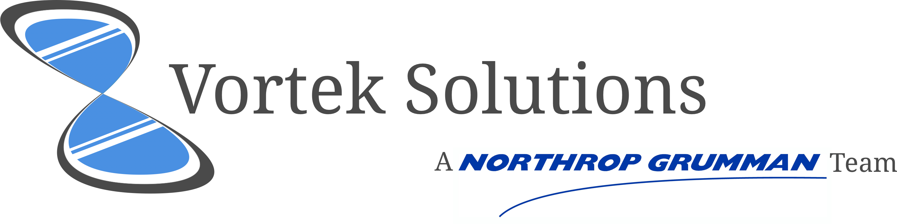

# Project Readme

We thank you for your participation in our Computer Information Systems Senior Project! We are proud to work with you as we progress through our final semester at California State University. Attached you will find all of our project documentation, links to code and more!

## Document Objective

The purpose of this document is to pose as an introduction to the project as well as provide a starting point for anyone who will be using this project in the future.

## Project Overview

### Statement of Business Context:

Northrop Grumman has existing systems related to their current manufacturing workflows. These systems run in a web browser showing statistics and information related to specific workflows. Created statistics are visualized in charts, or Visio style diagrams, which are not always easily read (especially on devices of various screen sizes such as the tablets used by upper management). The statistics and other pieces of information related to the workflows are then used in decision making at various levels throughout the organization.

### Statement of the Customer's Business Problem:

Northrop Grumman is in need of a versatile widget that would allow them to monitor their current workflow in an easy to process but highly descriptive manner. Currently the employees get this information printed out on a piece of a paper, which makes it inconvenient to deduce more information from. There's a lot more information that would be of use to the employees given that it was more accessible.

### Statement of Project Proposal

We propose a widget that will be able to receive multiple workflow objects and render it in the multiple browsers that Northrop Grumman supports. The widget will also be able to be styled using CSS and have the ability to add, update and edit a workflow's state.

### Statement of Deliverables

The deliverables will be:

- The final widget which will:

  - Be an executable, locally run widget, which interprets JSON data containing information of a specific workflow
  - Display workflows multiple workflows in a visual manner
  - Run on IE11+, Firefox 45+ and Edge

- IEEE SRS Documentation

- Developer's manual in Microsoft Word format

- User's manual in html

- Source Code

### What Medium Will the Product Be Delivered In

Source code that our clients at Northrop Grumman will be able to compile and run on their local machines via web browser (IE11+, Edge, Firefox 45)

### Outline of Project Measures of Success

**JAD 1** - Establish Requirements 
**JAD 2** - Finalize Requirements 
**Prototype 1** - Basic widget implemented to receive JSON data 
**Prototype 2** - Static Widget (i.e. can manually update values of Workflow modules, switch between admin and user) 
**Final Deliverable** - Dynamic Widget (i.e. widget is dynamically changed based on form input) 

## Project Documents (Links)

[Systems Requirements Specifications](https://docs.google.com/a/cougars.csusm.edu/document/d/1FBvXaSeZIsp7oOMNgWWfGTHuAPhJZadgh3N1JNydCYs/edit?usp=sharing)

- Details summary of project with specific use cases, terminology and proposed project applications

[Communications](https://github.com/jstngoulet/vorteksolutions/blob/master/Aditional%20Resources/VortekSolutions%20Communications.docx?raw=true)

- Demonstrates means for communications between team, client and instructor

Project Plan

- Summary of how the project will be implemented. Will include references to MS Project

[Roles](https://github.com/jstngoulet/vorteksolutions/blob/master/Aditional%20Resources/VortekSolutions%20Roles.docx?raw=true)

- Summary of team member's abilities in addition to key roles they will play in this project. Descriptions are provided in relation to project requirements

[Team Resumé](https://github.com/jstngoulet/vorteksolutions/blob/master/Aditional%20Resources/VortekSolutions%20Team%20Doc.docx?raw=true)

- Brief breakdown of specialties

[Individual Resumé's Folder](https://github.com/jstngoulet/vorteksolutions/tree/master/Aditional%20Resources/Resumés)

- Redirects to a hosted site with the current list of individual team member's resumés.

[Meeting Agendas / Minutes](https://github.com/jstngoulet/vorteksolutions/tree/master/Meeting%20Notes%20and%20Agendas)

- Directory of each meeting we will have, and already had, including meeting notes, agendas and topics we covered.

[Widget Testing Page](https://jstngoulet.github.io/vorteksolutions/code-ang/angular/index.html)

- Location of where the widget is being tested on the master branch

[User Manual](https://github.com/jstngoulet/vorteksolutions/tree/master/docs/User_Manual)

- Document that describes how to manage the code to make modifications.
- These documents may be found on this repository under docs/User_Manual. There are 19 documents provided.
